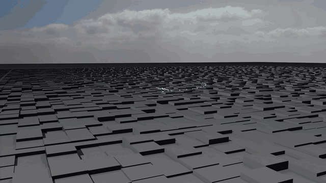
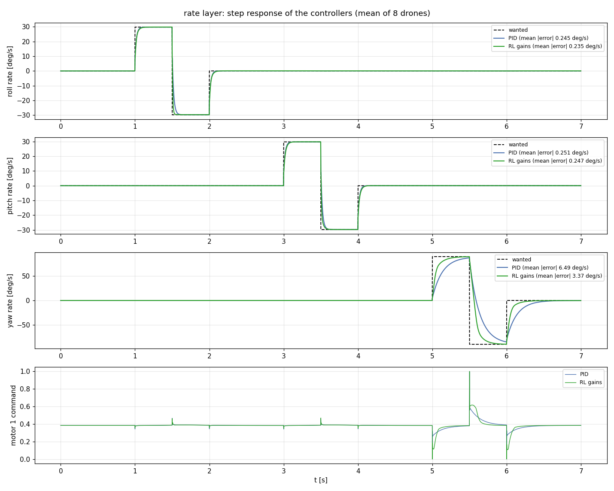
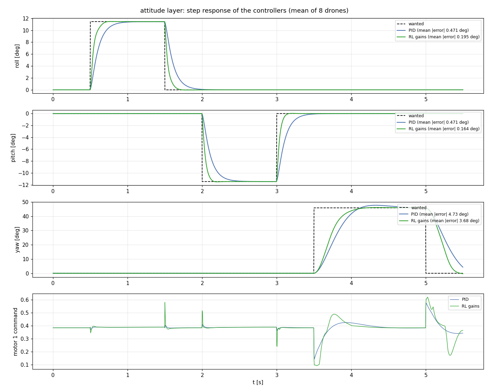
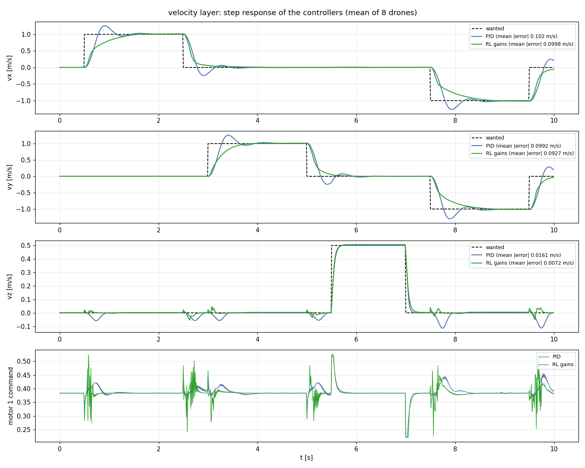
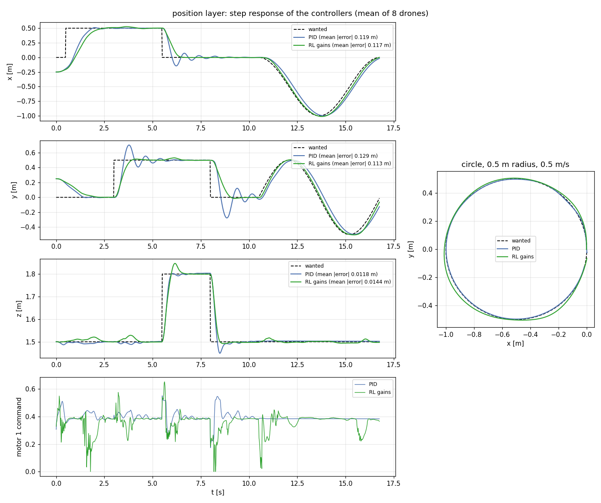

<p align="center">
  <a href="report/media/position_demo.mp4"></a>
</p>

# Drone_RL

Two ways to fly a **Crazyflie 2.1 Brushless** in **Isaac Lab 3.0**, compared layer by layer. Both are the same cascade:
position (50 Hz) → velocity (100 Hz) → attitude (250 Hz) → rate (500 Hz) → motors, on a 1 kHz physics step.

| Controller | What it does |
|---|---|
| **PID** | hand-tuned cascaded PID, the baseline |
| **RL gains** | a small network outputs the 9 PID gains of its layer at every step; the PID computes the command |

Each network is a small MLP trained with PPO, one layer at a time from the bottom up, then frozen, so it is small enough
for the drone's STM32. The physical constants come from the datasheet, published system identification papers and the
Bitcraze firmware.

## Results

Each controller is a full cascade from the layer shown down to the motors. Tracking error and motor chatter (mean change
of the motor commands per step) on the training task of each layer: random commands, 64 drones, one episode. Lower is
better.

| Layer | Error: PID | RL gains | Chatter: PID | RL gains |
|---|---|---|---|---|
| rate (deg/s) | 37.8 | **24.6** | **0.0063** | 0.0075 |
| attitude (deg) | 15.5 | **5.9** | **0.0021** | 0.0051 |
| velocity (m/s) | 0.85 | **0.46** | **0.0129** | 0.0342 |
| position (m) | 0.125 | **0.097** | **0.0032** | 0.0202 |

- **RL gains** cuts the PID's tracking error by 23 to 62 % on every layer and learns in a few hundred PPO iterations,
  because it starts from the tuned PID: zero output is exactly the PID, so it never produces an unstable controller.
- **PID** is the smoothest of the two, but slower and it rings after every step. The gain network shakes the motors more
  on the outer layers (2.6× to 6.3× the PID): that is the next thing to improve.

Step responses, top to bottom: **rate** (steps of 30 deg/s, yaw 90 deg/s), **attitude** (11.5 deg, yaw 46 deg),
**velocity** (1 m/s steps, then a diagonal) and **position** (0.5 m jumps, then a circle). Each plot shows the wanted
value (dashed), the two controllers and the command of motor 1.

<p align="center">
  <br>
  <br>
  <br>
  
</p>

## Install

You need Ubuntu 22.04 or 24.04 (x86_64), an NVIDIA RTX GPU with driver **580.65 or newer** (`nvidia-smi`), about 30 GB of
free disk, [Miniconda](https://docs.conda.io/projects/miniconda/en/latest/) and `git`. NVIDIA recommends 16 GB of VRAM
and 32 GB of RAM; this project was built on an RTX 3060 (12 GB) with 31 GB of RAM. Run the steps in order, in one
terminal.

**1. Python environment** (Isaac Sim 6.1 needs Python 3.12):

```bash
conda create -n env_isaaclab python=3.12 -y
conda activate env_isaaclab
python -m pip install --upgrade pip
```

**2. Isaac Sim 6.1, then PyTorch for CUDA 13.0** (about 10 GB; the PyTorch line must come second):

```bash
pip install "isaacsim[all,extscache]==6.1.0.0" --extra-index-url https://pypi.nvidia.com
pip install -U torch==2.12.0 torchvision==0.27.0 --index-url https://download.pytorch.org/whl/cu130
```

**3. Isaac Lab 3.0**, at the commit this project was built on:

```bash
sudo apt install cmake build-essential
cd ~/Documents/GitHub
git clone https://github.com/isaac-sim/IsaacLab.git
cd IsaacLab && git checkout e53ef4ad
./isaaclab.sh -i        # Isaac Lab, rsl-rl and the `isaaclab` command (a deprecation warning is normal)
./isaaclab.sh -p scripts/tutorials/00_sim/create_empty.py --viz kit    # check: opens an empty black window
```

The first start asks you to accept the NVIDIA licence (type `Yes`) and downloads extensions: it can take over ten
minutes, later starts take seconds. If something fails, see the
[official guide](https://isaac-sim.github.io/IsaacLab/develop/source/setup/installation/index.html).

**4. This project**, next to Isaac Lab:

```bash
cd ~/Documents/GitHub
sudo apt install git-lfs && git lfs install
git clone https://github.com/vohongquann/Drone_RL.git
cd Drone_RL && git lfs pull        # the drone model (.usd) and the trained networks (.pt) are LFS files
pip install -e . --no-deps
pip install pytest && python -m pytest tests -q
```

The tests need no simulator. Run everything below from `Drone_RL` with `env_isaaclab` active.

## Try it

```bash
# record the trained gain cascade flying a circle and a figure 8 (headless, writes videos/demo/position_demo.mp4)
python src/Drone_RL/uav/tools/record_position_demo.py --seconds 8 --width 1280 --height 720

# fly the hand-tuned PID in the Isaac Sim window
python src/Drone_RL/uav/pid_control/pid_hover_test.py --scenario square --viz kit

# compare PID and RL gains on one layer (rate, attitude, velocity or position; about a minute each)
python src/Drone_RL/uav/tools/compare_layers.py --layer position --methods pid,gains
```

Leave out `--seconds/--width/--height` for the full 1440p clip; add `--sky night` for a night scene or `--sky color`
offline (the sky texture is downloaded once). `compare_layers.py` writes `report/figures/compare_<layer>_pid_gains.png`
and `report/metrics/<layer>.json`.

## Train your own

The trained networks are already in `src/Drone_RL/uav/rl_control/frozen/gains/`. To retrain, go bottom-up,
**rate → attitude → velocity → position**: each layer runs on top of the frozen layers below it. For the rate layer:

```bash
# 1. train (logs/rsl_rl/uav_rate_gains/<run>/, a video clip every 5000 steps)
isaaclab train --rl_library rsl_rl --task Isaac-UAV-Rate-Gains-v0 --num_envs 2048 \
    --video --video_length 2500 --video_interval 5000
# 2. export the last checkpoint to <run>/exported/policy.pt
isaaclab play --rl_library rsl_rl --task Isaac-UAV-Rate-Gains-v0 --num_envs 1
# 3. freeze it: the next layer loads this file
cp logs/rsl_rl/uav_rate_gains/<run>/exported/policy.pt src/Drone_RL/uav/rl_control/frozen/gains/rate.pt
```

| Layer | Task | `--video_length` | Frozen file |
|---|---|---|---|
| rate | `Isaac-UAV-Rate-Gains-v0` | 2500 | `frozen/gains/rate.pt` |
| attitude | `Isaac-UAV-Attitude-Gains-v0` | 1250 | `frozen/gains/attitude.pt` |
| velocity | `Isaac-UAV-Velocity-Gains-v0` | 500 | `frozen/gains/velocity.pt` |
| position | `Isaac-UAV-Position-Gains-v0` | 250 | `frozen/gains/position.pt` |

- `isaaclab train` exits with code 0 even when it fails: the run worked if the output ends with `Training time`.
- Keep `--num_envs` at 2048 or less with `--video` (about 20 GB of RAM).
- Watch `Metrics/layer/error` in TensorBoard (`tensorboard --logdir logs/rsl_rl`): the tracking error of the layer.
- After changing a constant in `uav_cfg.py`, retrain from the lowest layer it affects. To rebuild the report, run
  `compare_layers.py --methods pid,gains` for the four layers, then `python src/Drone_RL/uav/tools/report_figures.py`.

## How it works

```text
src/Drone_RL/uav/
├── uav_cfg.py        every physical constant, with its source
├── pid_control/      the hand-tuned PID of each layer, PID flight test
├── mdp/              actions (motor curve, mixer, gain cascade), layers, gains, rewards, observations
├── rl_control/       the tasks (<layer>_env_cfg.py, gains_env_cfg.py), PPO configs, frozen/ networks
└── tools/            demo recorder, controller comparison, report figures
```

A gain network outputs a number `a` in [-1, 1] per gain. A gain the tuned PID already has becomes `tuned × 3^a`, so
`a = 0` is exactly the tuned PID and the network can scale it from a third to three times. A gain the PID does not use
(for example the derivative of the position layer) becomes `maximum × max(a, 0)`. The network can only reshape a
controller that already works, which is why it learns fast and keeps the motors close to the PID's smoothness.

## Limitations

Simulation only, not yet flown on hardware. Not modelled: motor lag, the onboard state estimator (the controllers see the
true state) and wind. The propeller mass and the IMU vibration noise are assumptions.

## Acknowledgements

Built on [Isaac Lab](https://github.com/isaac-sim/IsaacLab) and [rsl_rl](https://github.com/leggedrobotics/rsl_rl).
Parameters from the Crazyflie 2.1 Brushless datasheet, the [Bitcraze firmware](https://github.com/bitcraze/crazyflie-firmware),
Busetto et al. (arXiv:2512.14450), Folk et al. (arXiv:2604.00343) and the Bosch BMI088 datasheet. The gain-scheduling
idea comes from the FPV-Drone-Tracking project. Licence: see [LICENSE](LICENSE).
