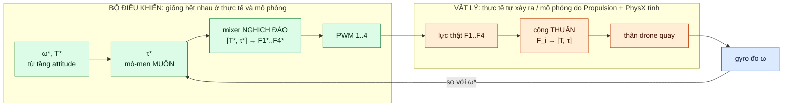
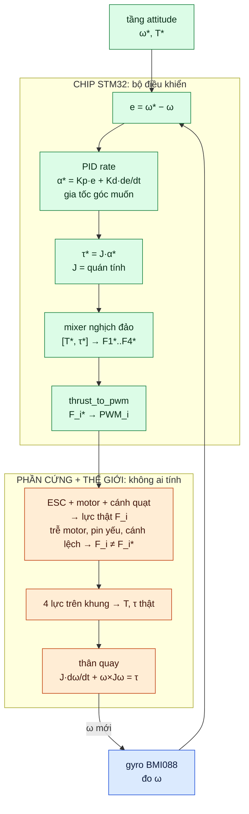
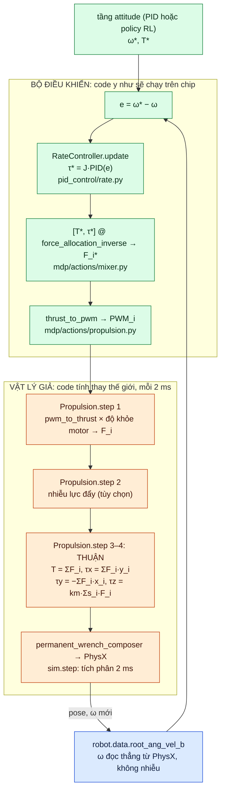
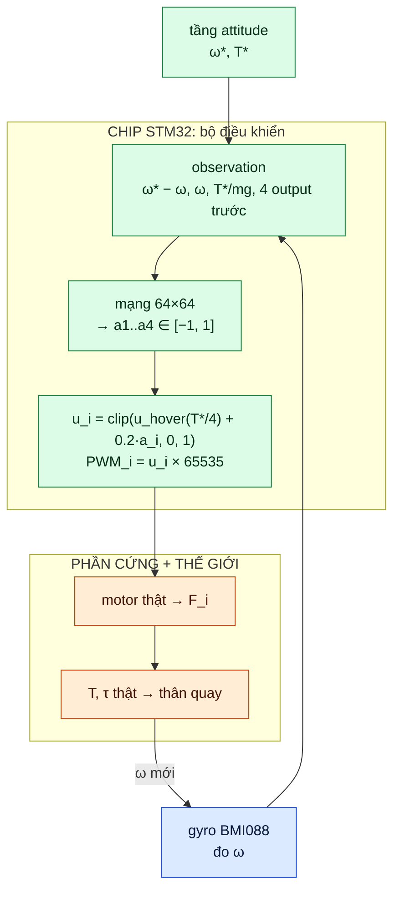
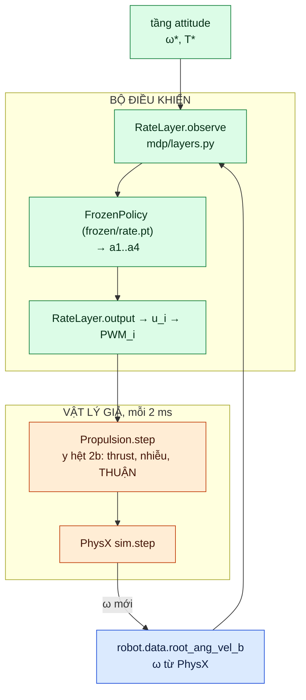

# docs: sources (local only)

This folder holds the documents the numbers of the simulation come from. It is listed in `.gitignore` (the PDFs are
not ours to publish). The documentation itself is [guide/](../guide/readme.md); every value taken from these files is
listed with its source in [guide/01_drone.md](../guide/01_drone.md).

| File | Used for |
|---|---|
| `hardware/crazyflie-brushless/bitcraze_crazyflie_2.1_brushless_datasheet_rev3.pdf` | frame size, mass, motors (guide 1.2) |
| `hardware/crazyflie-brushless/folk_2026_real_time_local_wind_inference_for_robust_autonomous_navigation.pdf` | motor thrust curve, air drag (guide 1.2, 2.1) |
| `hardware/crazyflie-brushless/busetto_2025_nonlinear_system_identification_nano-drone_benchmark.pdf` | inertia, yaw torque ratio $k_M/k_F$ (guide 1.2, 2.2) |
| `hardware/crazyflie-brushless/eschmann_2024_data-driven_system_identification_of_quadrotors_subject_to_motor_delays.pdf` | state list of the landing observation (guide 6.4) |
| `hardware/crazyflie-brushless/ullah_2026_nanobench_multi-task_benchmark_dataset_for_nano-quadrotors.pdf` | thrust-to-weight cross-check |
| `hardware/crazyflie2.1_revb.pdf` | Crazyflie 2.1 Rev B schematic |
| `hardware/papers-crazyflie-modelling.pdf` | Crazyflie modelling thesis (background) |

---

# Ghi chú nghiên cứu: flow tầng rate, thực tế và mô phỏng

## 0. Ba loại đại lượng

Mọi ô trong các sơ đồ dưới đây thuộc một trong ba loại (màu trong sơ đồ: xanh dương, xanh lá, cam):

| Nhãn | Nghĩa | Ví dụ |
|---|---|---|
| **[ĐO]** (xanh dương) | cảm biến đo được | $\boldsymbol\omega$ (gyro) |
| **[TÍNH]** (xanh lá) | bộ điều khiển tự tính ra, là *lệnh* (có dấu $^*$) | $\boldsymbol\omega^*$, $\boldsymbol\tau^*$, $F_i^*$, PWM |
| **[VẬT LÝ]** (cam) | xảy ra thật, không ai tính (trong mô phỏng thì code tính thay) | lực $F_i$, mô-men $\boldsymbol\tau$, chuyển động |

- $\boldsymbol\tau^*$ là mô-men bộ điều khiển **muốn**. $\boldsymbol\tau$ là mô-men **thật** tác dụng lên thân. Không có cảm biến đo $\boldsymbol\tau$.
- Nếu mô hình đúng thì $\boldsymbol\tau = \boldsymbol\tau^*$. Nếu sai thì gyro thấy $\boldsymbol\omega$ chưa đạt và PID bù ở vòng sau.

## 1. Bức tranh chung: hai nửa, hai chiều

Màu: xanh dương = [ĐO], xanh lá = [TÍNH], cam = [VẬT LÝ].

- **Nghịch đảo** ($[T^*, \boldsymbol\tau^*] \to F_i^*$, `force_allocation_inverse`): bộ điều khiển nghĩ theo "thân cần mô-men bao
  nhiêu", motor chỉ hiểu lực/PWM của riêng nó, nên phải đổi ngược.
- **Thuận** ($F_i \to [T, \boldsymbol\tau]$, công thức trong `Propulsion.step`): 4 lực cộng lại trên khung. Ngoài đời không ai tính
  bước này, vật lý tự làm. Chỉ mô phỏng mới phải viết nó thành code.

## 2. Trường hợp 1: rate do PID

### 2a. Thực tế (Crazyflie bay thật)

Firmware gốc của Crazyflie làm gọn hơn: PID rate ra thẳng "lệnh roll/pitch/yaw" theo đơn vị PWM, mixer chỉ cộng trừ
(m1 = thrust − roll + pitch + yaw ...). $J$ và hệ số lực đẩy đã nằm sẵn trong gain. Project này tách $J$ và mixer ra theo
đơn vị vật lý (N, N·m), nhưng ý tưởng giống hệt.

### 2b. Mô phỏng (Isaac Lab)

Trong code: cascade PID (`pid_control/cascade.py`, `pid_hover_test.py`) và task `Isaac-UAV-Attitude-PIDRate-RL-v0`
(`PIDRateLayer` trong `mdp/actions/cascade_action.py`).

## 3. Trường hợp 2: rate do model (policy RL)

Mạng neural thay **cả cụm** "PID rate → τ* → mixer → thrust_to_pwm". Nó ra thẳng 4 lệnh motor, không có $\boldsymbol\tau^*$, không có mixer.

### 3a. Thực tế

### 3b. Mô phỏng

Mạng đã **tự học luôn phần mixer**: trong lúc train nó thử 4 lệnh motor, Propulsion + PhysX cho thấy drone quay ra sao,
và reward dạy nó tổ hợp nào cho ra đúng $\boldsymbol\omega^*$.

## 4. Bảng đối chiếu từng bước

| Bước | Thực tế | Mô phỏng | Rate PID | Rate RL |
|---|---|---|---|---|
| Đo $\boldsymbol\omega$ | gyro BMI088 (nhiễu, rung) | `robot.data.root_ang_vel_b` (PhysX, không nhiễu) | có | có |
| Ra $\boldsymbol\omega^*, T^*$ | tầng attitude trên chip | tầng attitude (PID hoặc RL) | có | có |
| $\boldsymbol\tau^* = J\cdot\mathrm{PID}(e)$ | firmware | `RateController.update` | có | **không** |
| Mixer nghịch đảo $[T^*,\boldsymbol\tau^*] \to F_i^*$ | firmware (power distribution) | `force_allocation_inverse` | có | **không** (mạng tự học) |
| Ra PWM | firmware | `thrust_to_pwm` / `RateLayer.output` | có | có |
| PWM → lực $F_i$ | motor, cánh quạt thật | `Propulsion.step` bước 1–2 | có | có |
| Thuận $F_i \to T, \boldsymbol\tau$ | vật lý tự làm | `Propulsion.step` bước 3–4 | có | có |
| $T, \boldsymbol\tau$ → chuyển động | định luật Newton | PhysX (`sim.step`, 2 ms) | có | có |

**Tóm lại:**
- Khung **bộ điều khiển / chip** (ô xanh lá) giống nhau giữa thực tế và mô phỏng. Đó chính là thứ đem lên drone.
- Khung **vật lý** (ô cam) là thế giới. Ngoài đời thì tự xảy ra. Trong mô phỏng thì `Propulsion` + PhysX bắt chước nó, và mô phỏng
  càng giống thật thì policy/gain mang sang drone thật càng ít phải chỉnh.
- Mixer **nghịch đảo** thuộc bộ điều khiển (chỉ có khi rate là PID). Công thức **thuận** thuộc vật lý (chỉ phải viết ra
  trong mô phỏng).

