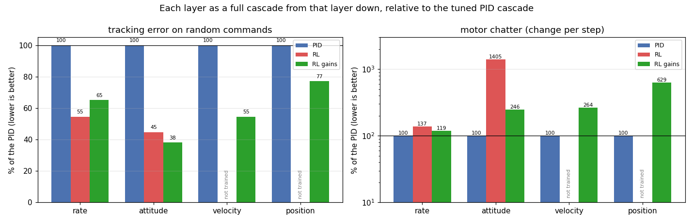
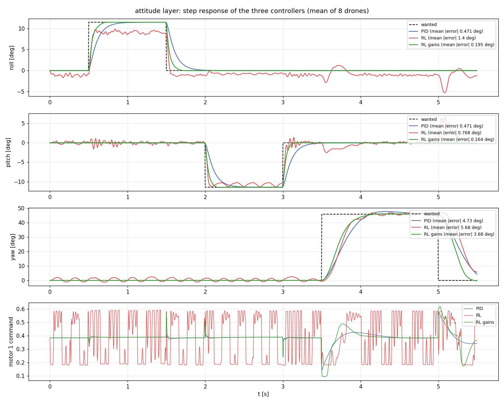
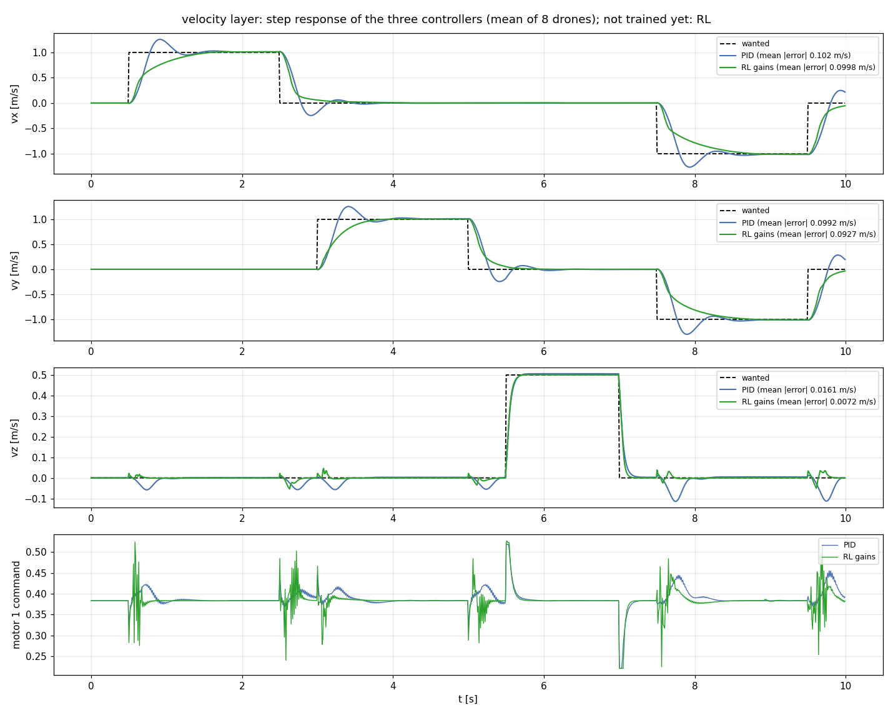
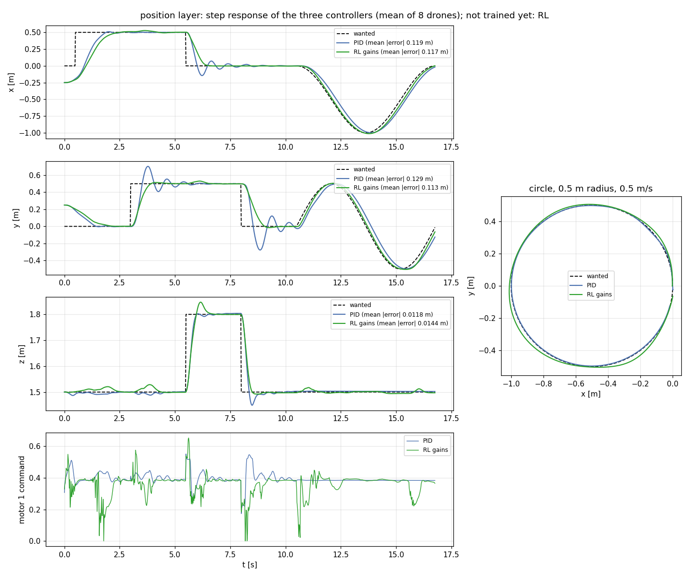
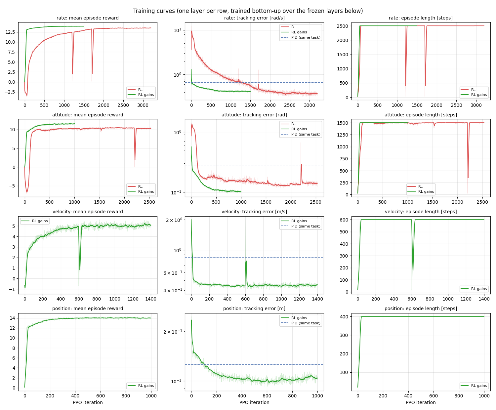

# Results: PID vs RL vs RL gains, layer by layer

This report compares three controllers for the Crazyflie 2.1 Brushless on each layer of the cascade. Each one runs as a
full cascade from that layer down to the motors:

| Controller | The layer itself | The layers below |
|---|---|---|
| **PID** | hand-tuned PID | hand-tuned PID |
| **RL** | network that outputs the command for the layer below (`frozen/rl/<layer>.pt`) | frozen RL networks |
| **RL gains** | network that outputs the 9 PID gains of the layer (`frozen/gains/<layer>.pt`) | frozen gain networks |

> **Status.** The RL cascade has trained rate and attitude layers. Its velocity and position layers are **not trained
> yet**, so they are marked "not trained" below. The PID and the gain cascade are complete.

All numbers come from `src/Drone_RL/uav/tools/compare_layers.py`: headless, the same random seed for the three
controllers, Isaac Sim 6.1 and a 1 kHz physics step. The raw values are in [`metrics/`](metrics).

## 1. Summary



**Tracking error on random commands.** This is the training task of the layer: 64 drones, one full episode, with
random commands coming from the PID layers above plus random offsets. It is the hard test, because the command keeps
jumping. Lower is better.

| Layer (unit) | PID | RL | RL gains | Best |
|---|---|---|---|---|
| rate (deg/s) | 37.8 | **20.6** | 24.6 | RL, -45 % |
| attitude, tilt (deg) | 15.5 | 6.9 | **5.9** | RL gains, -62 % |
| velocity (m/s) | 0.85 | not trained | **0.46** | RL gains, -45 % |
| position (m) | 0.125 | not trained | **0.097** | RL gains, -23 % |

**Motor chatter.** The mean change of the motor commands per control step, on the same task. Lower means smoother
motors (less heat, less vibration on a real drone).

| Layer | PID | RL | RL gains |
|---|---|---|---|
| rate | **0.0063** | 0.0086 | 0.0075 |
| attitude | **0.0021** | 0.0289 | 0.0051 |
| velocity | **0.0129** | not trained | 0.0342 |
| position | **0.0032** | not trained | 0.0202 |

Every drone of every controller was still flying at the end of the episode (no crash, no flip).

**In short:**

- **RL gains** has the lowest error on three of the four layers and is close to the best on the rate layer. It starts
  from the PID (zero output is the tuned PID) and only reshapes it, so it learns in a few hundred iterations and never
  produces an unstable controller. Its weak point is smoothness on the outer layers: on velocity and position it
  changes the gains fast enough to shake the motors 2.6× and 6.3× more than the PID. A stronger penalty on the change
  of the gains is the next thing to try.
- **RL** (direct commands) follows random commands well, but it does it by chattering: on the attitude layer the motor
  commands jump between 0.18 and 0.59 at every step (14× the PID), and on the clean steps below it holds a steady
  offset. That makes it the hardest of the three to put on a real drone.
- **PID** is the smoothest and the most predictable, but the slowest: on fast commands, and on yaw in particular, it
  lags the most.

## 2. Step responses

Each figure shows the mean of 8 drones following a fixed test signal: the wanted value (dashed), the three controllers,
and below them the command of motor 1, to show how hard each one works the motors. The mean |error| in the legends is
over the whole test.

### 2.1 Rate layer (500 Hz): body rate steps of 30 deg/s (roll, pitch) and 90 deg/s (yaw)


| mean \|error\| (deg/s) | roll | pitch | yaw |
|---|---|---|---|
| PID | 0.24 | 0.25 | 6.49 |
| RL | 1.94 | 1.56 | 6.50 |
| RL gains | **0.23** | **0.25** | **3.37** |

The gain network matches the PID on roll and pitch, which were already well tuned, and **halves the yaw error** by
raising the yaw gain. The RL rate network oscillates at about 15 Hz around every set point and shakes the motors between
0.3 and 0.47 even in hover.

### 2.2 Attitude layer (250 Hz): roll and pitch steps of 11.5 deg, a yaw step of 46 deg



| mean \|error\| (deg) | roll | pitch | yaw |
|---|---|---|---|
| PID | 0.47 | 0.47 | 4.73 |
| RL | 1.40 | 0.77 | 5.68 |
| RL gains | **0.20** | **0.16** | **3.68** |

RL gains reaches the wanted angle about twice as fast as the PID, with no overshoot, and keeps the motors smooth. The RL
attitude network stops at 9 deg instead of 11.5 deg on the roll step and drives the motors bang-bang.

### 2.3 Velocity layer (100 Hz): steps of 1 m/s in x, then in y, 0.5 m/s up, then a diagonal



| mean \|error\| (m/s) | vx | vy | vz |
|---|---|---|---|
| PID | 0.102 | 0.099 | 0.016 |
| RL | not trained | | |
| RL gains | **0.100** | **0.093** | **0.007** |

The PID overshoots every step by about 25 % and rings. The gain network removes the overshoot and halves the height
error while the drone accelerates sideways, but it reaches the new speed more slowly. On clean steps the two have the
same mean error; on the random commands of the training task the gain network halves it (section 1).

### 2.4 Position layer (50 Hz): target jumps of 0.5 m, a 0.3 m climb, then a circle of 0.5 m radius at 0.5 m/s



| mean \|error\| (m) | x | y | z |
|---|---|---|---|
| PID | 0.119 | 0.129 | **0.012** |
| RL | not trained | | |
| RL gains | **0.117** | **0.113** | 0.014 |

The PID overshoots the y jump by 0.2 m and rings for 2 s; the gain network settles without overshoot and follows the
circle with less lag. Both start 0.25 m away from the first target, which adds the same error to both.

## 3. Training curves



One row per layer: mean episode reward, tracking error (`Metrics/layer/error`, log scale, the same quantity for both
cascades), and episode length (the maximum means no drone crashed). The dashed line is the tracking error of the tuned
PID on the same task. A sharp dip in a curve marks a resumed run (the first episodes after a restart are short), not a
failure.

| Layer | RL iterations | RL gains iterations |
|---|---|---|
| rate | 3200 | 1500 |
| attitude | 2530 | 1000 |
| velocity | not trained | 1400 |
| position | not trained | 1000 |

- The gain cascade starts from the PID (above the PID line at first only because of the exploration noise) and goes
  below the PID line within about 100 iterations on every layer. The RL cascade starts from scratch: on the rate layer
  it needs about 1100 iterations to reach the PID and about 2000 to reach the gain network.
- The rewards of the two cascades are not comparable: their penalty terms differ (the RL layers are penalised for
  changing the motor or rate commands, the gain layers for changing the gains). Compare them with the tracking error.

## 4. How to reproduce

```bash
python src/Drone_RL/uav/tools/compare_layers.py --layer rate        # then attitude, velocity, position
python src/Drone_RL/uav/tools/report_figures.py
```

`compare_layers.py` skips a controller whose frozen networks are missing and marks it in the json, so the report can
be rebuilt at any stage of training. The training curves are read from `logs/rsl_rl/`.

## 5. Limits of this comparison

- Simulation only. The controllers see the true state, with no estimator, no motor lag and no wind.
- One seed and one set of trained networks per controller. The random-command test uses 64 drones over a full
  episode; the step tests use 8.
- The PID gains were tuned by hand, once. A better-tuned PID would narrow the gap; the gain network shows how much
  each gain could change and in which direction.
